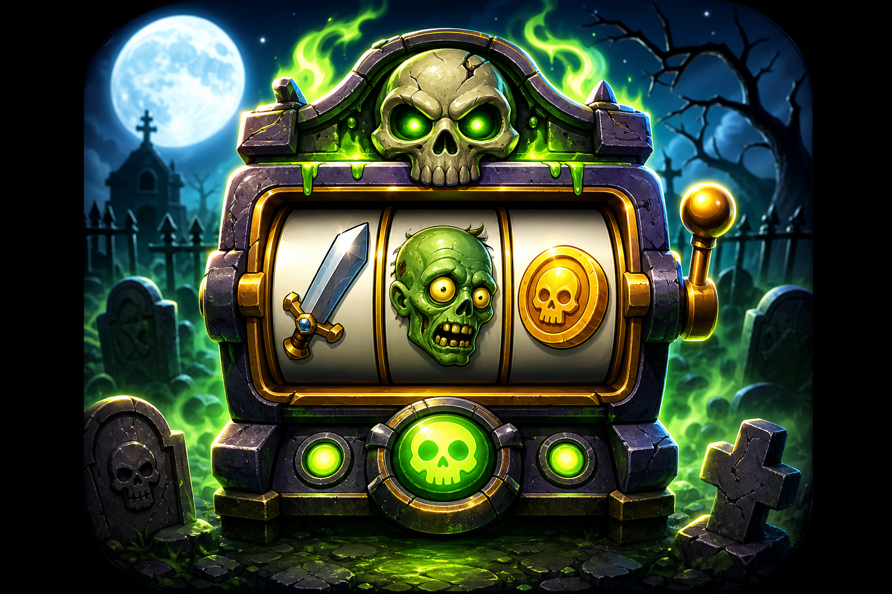

# Zombie Slots: Graveyard Defense

A vertical (portrait) mobile-style game where you defend your graveyard gate from
waves of zombies using a cursed **slot machine**. Every spin generates attacks,
healing, coins, armor, or special effects. Survive escalating waves, slay bosses,
earn coins, and upgrade your machine.

Built as a self-contained web game with **vanilla HTML / CSS / JavaScript** — no
build step and no dependencies. Designed portrait-first for phones; on wider screens
it renders inside a centered "device" frame.



## Run it

It's just static files. Serve the project root with any static server:

```bash
# Python 3
python3 -m http.server 8080
# then open http://localhost:8080/index.html
```

or

```bash
npx serve .
```

Open the URL in a browser (best viewed in a narrow / portrait window or mobile
device emulation).

## How to play

1. Press **PLAY**. Zombies march toward your gate **in real time** — they keep
   advancing whether or not you act.
2. Tap **SPIN** to attack; each reel lands on a symbol and combos resolve instantly.
   Spins recharge over time up to a cap, so you can always keep fighting.
3. Toggle **AUTO** (left of SPIN) to spin continuously hands-free.
4. When zombies reach the gate they stop and attack it on a cooldown, draining your
   armor and then HP. Kill them before they overwhelm you.
5. Clear all zombies to finish the wave, collect a bonus, and buy upgrades.
6. Zombie **attack power and speed creep up slowly each wave**. A **boss** appears
   every 5th wave. The gate falling to 0 HP ends the run. After Wave 20 you enter
   scaling **Endless** mode.

### Slot symbols

| Symbol | Effect |
|--------|--------|
| ⚔️ Sword | Single-target damage (1/2/3 → 10/30/75) |
| 💣 Bomb | Area (splash) damage (1/2/3 → 15/40/100) |
| ❤️ Heart | Heal the gate (1/2/3 → 10/30/75) |
| 🪙 Coin | Earn gold (1/2/3 → 10/30/75) |
| ⚡ Lightning | Chain damage across the frontmost zombies |
| 🛡️ Shield | Temporary armor that absorbs gate damage |
| 💀 Skull | Heavy critical damage |
| 🔄 Spin | Extra spins |

### Notable combos

- **Sword + Sword + Bomb** → 50 dmg + small blast
- **Sword + Bomb + Bomb** → 75 dmg + stun all
- **Heart + Heart + Shield** → full heal + armor (GUARDIAN)
- **Coin + Coin + Coin** → JACKPOT
- **Skull + Skull + Skull** → instantly kill the strongest zombie
- **Spin + Spin + Spin** → +5 spins

### Resources & progression

- **Coins** — spent on per-run upgrades in the between-wave shop.
- **Gate HP** — your life total; the run ends when it hits 0.
- **Souls (Soul Bank)** — a share of each run's coins is banked permanently and spent
  on the **Research Tree** (max HP, better odds, coin rewards, boss damage, extra
  starting spins, and a 4th reel). Progress is stored in `localStorage`.

## Project structure

```
index.html        # markup: menu, game screen, overlays
css/styles.css    # dark graveyard theme, portrait layout, animations
js/data.js        # symbols, combos, zombies, bosses, wave generation, upgrades, research
js/game.js        # game engine: state, spins, combat, waves, shop, meta, rendering
assets/icon.png   # generated app icon
```

## Zombies & bosses

- **Walker / Runner / Tank / Exploder / Necromancer** — varied HP, speed, damage and
  coin rewards. Exploders detonate at the gate; Necromancers summon walkers.
- **Bosses:** The Butcher (500 HP), Toxic Giant (1000 HP, poisons the gate), and the
  Grave King (2000 HP, summons the dead). Bosses scale further in Endless mode.
